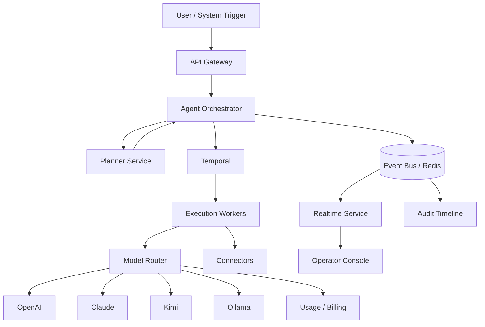

# Execution architecture

## Canonical flow



ASCII equivalent (for plain-text readers):

```txt
User
 ↓
API Gateway          ← auth, tenancy, idempotency
 ↓
Orchestrator         ← run state machine
 ↓
Planner              ← LLM plans & tool selection (Phase 2)
 ↓
Temporal             ← durable retries, waits, compensation
 ↓
Execution Workers    ← activities, connectors, browser jobs
 ↓
Model Router         ← provider choice + fallback
 ↓
Providers            ← OpenAI / Claude / Kimi / Ollama
 ↓
Event Bus            ← hot-path fanout
 ↓
Realtime + Audit     ← SSE to UI, compliance timeline
```

## Planes

| Plane | Responsibility | Repo |
|-------|----------------|------|
| Experience | Console, approvals, run visibility | `apps/web-app` |
| Control | APIs, policy, orchestration decisions | `apps/api-gateway`, `services/agent-orchestrator` |
| Execution | Workers, model calls, connectors | `services/*-worker*`, `services/model-router` |

## Phase 1 (shipped in repo)

- Orchestrator + BullMQ when Temporal is unavailable
- Model router with mock + OpenAI and circuit-breaker fallback
- Postgres-backed events + SSE realtime
- Single reference vertical: **Support Ops** (see `docs/verticals/SUPPORT_OPS.md`)

## Phase 2 (documented, not all implemented)

- Planner split from orchestrator
- Redis Streams / NATS event bus
- Operator console controls (see `docs/OPERATOR_CONSOLE.md`)
- Provider-agnostic **execution replay** (see `docs/EXECUTION_REPLAY.md`)
